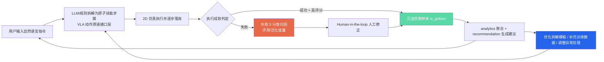
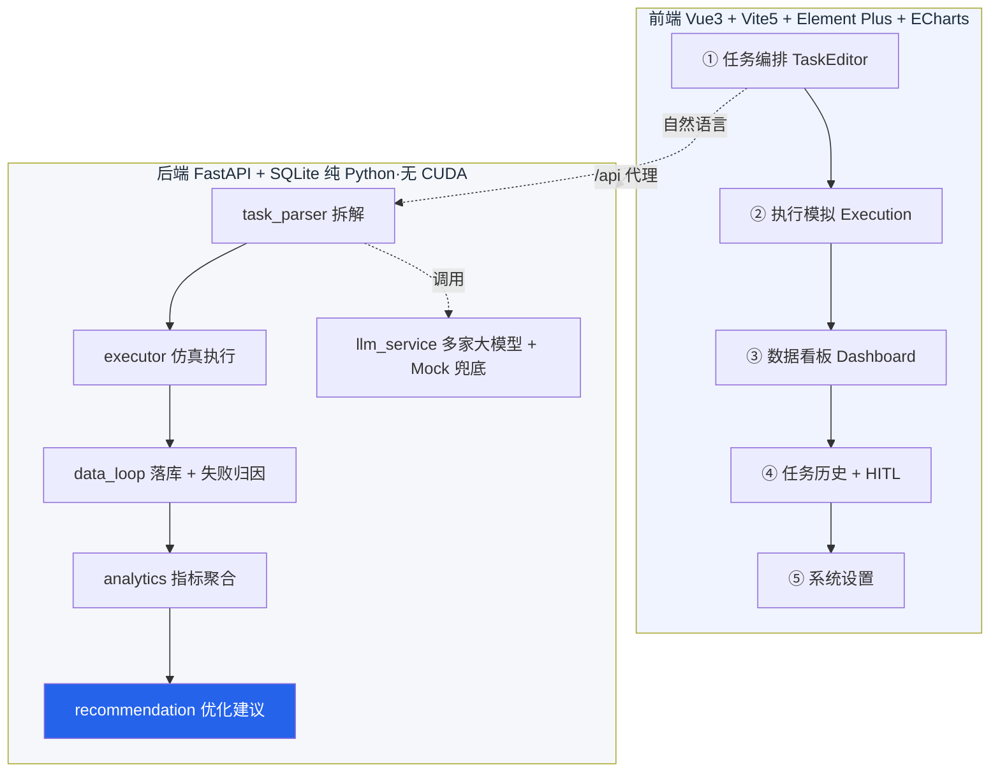

# 具身智能任务编排平台 + 数据闭环系统

> 自然语言 → 任务编排 → 仿真执行 → 数据闭环 → 数据看板 → 优化建议
> 一个面向具身智能应用的全栈系统，展示从自然语言任务编排到执行数据闭环的完整流程。

[](#)
[](#)
[](#)
[](#)

---

## 一、项目定位与亮点

本项目是一个**端到端（end-to-end）的具身智能任务编排与数据闭环平台**，用一条完整产品动线，演示「一句话指令」如何变成「可执行、可观测、可优化」的机器人任务，并在使用中**不断自我进化**。

从架构定位上看，平台可视作一层轻量的 **VLA（视觉-语言-动作，Vision-Language-Action）应用层**：自然语言指令经拆解落到 25 个标准**原子技能**上，这 25 个技能构成面向机器人的**动作原语接口层（action primitives interface layer）**——它天然对应真实 VLA 模型 / 机器人 SDK 的动作输出，未来把仿真执行器替换为真机推理即可平滑落地。与此同时，失败 5 分类 + 优质样本闭环共同构成一套面向具身智能的**评测体系（benchmark）与泛化能力度量（generalization metrics）**：用任务成功率、分场景成功率、拆解泛化度等指标，量化「系统在没见过的新指令 / 新场景上到底行不行」。

平台提供**任务编排、指标体系、数据闭环与评测口径**，用于验证机器人任务从输入到持续优化的完整流程。

### 核心故事线（一句话穿起来）

```
自然语言指令  →  LLM/规则拆解为原子技能步骤  →  2D 仿真逐步执行  →  成功/失败数据落库
      ↑                                                                         │
      │                                                                         ▼
  反哺拆解模板  ←  优化建议（数据驱动）  ←  指标看板 + 失败归因  ←  数据沉淀（含优质样本/人工修正）
```

这正是具身智能产品的**核心竞争力来源**：模型与数据的飞轮。Demo 把这个抽象飞轮**可视化、可交互、可量化**。

### 数据飞轮总图（一图看懂「越用越好」）

> 下图为数据闭环飞轮：每一次使用都产出可评测的数据，经聚合分析生成优化建议，反哺拆解环节（`I → B`），让系统越用越准。GitHub 会直接渲染该 Mermaid 图。



### 系统架构总图（五大模块 + 分层）

> 编排层 / 执行层解耦：当前执行层为 2D 仿真，未来可平滑替换为真机或高保真仿真（Isaac Sim / MuJoCo），闭环逻辑完全复用。



### 产品亮点

- **自然语言驱动**：输入「把红色的杯子放到桌子右边」，自动拆解出「识别 → 定位 → 抓取 → 移动 → 放置」等原子技能步骤，并给出目标、约束、异常处理。这 25 个原子技能即 VLA 动作原语接口层，向上承接语言意图、向下对接机器人动作。
- **双策略可对比**：内置 `LLM` 智能拆解与 `rule` 规则拆解两条路径，可在执行页一键**策略对比**（步骤数 / 耗时 / 成功率 / 雷达图），体现产品决策的 A/B 思维。
- **2D 俯视仿真**：用 SVG 动画演示机器人移动、抓取、放置的执行过程，支持暂停 / 继续 / 重新执行，让「执行」可被看见。
- **完整数据闭环 + 评测口径**：每次执行的步骤、耗时、成功与否、失败归因（5 类）全部落库；失败任务按规则进入 **Human-in-the-loop（人工介入）** 队列，人工修正后沉淀为**优质样本**。这套「成功率 + 失败 5 分类 + 优质样本」机制本身就是一个可持续运行的具身智能**评测体系（benchmark）**，用于量化拆解的**泛化能力（generalization）**——同一套技能在新指令、新场景下是否依然拆得对、跑得通。
- **企业级数据看板**：北极星指标、过程指标、结果指标三层指标体系；趋势图、失败 Top10、5 类失败占比、难度分布、策略对比雷达图等多维图表，开箱即有约 150 条历史数据。
- **数据驱动的优化建议**：基于真实聚合数据自动生成「感知失败占比 35%，建议补充遮挡场景数据」这类**具体、可执行、带证据**的优化条目，闭合「数据 → 洞察 → 行动」。
- **多家大模型 + Mock 兜底**：支持 OpenAI / 通义千问 / 智谱；**无 API Key 时自动进入 Mock 模式**，全功能可离线运行，便于快速体验与验证。
- **Apple Silicon 原生友好**：后端只用 Python 标准库 `sqlite3` + 纯 Python 依赖（FastAPI / httpx / pydantic），**禁止任何需要编译的科学库（numpy / pandas / torch）与 CUDA**，在 Mac Studio / MacBook（M 系列芯片）上 `pip install` 秒装、零踩坑。

---

## 二、功能模块总览（五大模块）

| 模块 | 页面 | 核心能力 |
|---|---|---|
| **① 任务编排** | `/task` TaskEditor | 自然语言输入、策略选择、10 条示例指令一键填入、可视化流程图（目标 / 约束 / 步骤 / 异常）、步骤拖拽增删改、技能库取用 |
| **② 执行模拟** | `/execution` Execution | 2D 俯视仿真动画、逐步播放（暂停 / 继续 / 重新执行）、实时执行日志与失败原因、执行完弹出评分反馈、策略对比 |
| **③ 数据看板** | `/dashboard` Dashboard | 4 张核心指标卡、近 30 天趋势、失败归因分析、任务分析、策略对比、数据驱动的优化建议列表 |
| **④ 任务历史** | `/history` History | 全量任务表格（筛选 / 排序）、任务详情回放（步骤日志 / 反馈 / 拆解结果）、人工介入（HITL）队列与步骤修正 |
| **⑤ 系统设置** | `/settings` Settings | 大模型配置（provider / model / api_key / temperature）、仿真配置、数据配置、技能库增删改查、当前模式展示 |

---

## 三、技术栈

### 后端

- **语言 / 框架**：Python 3.10+（实测 3.14 亦可）、[FastAPI](https://fastapi.tiangolo.com/) 0.111、[Uvicorn](https://www.uvicorn.org/) 0.30
- **数据库**：SQLite（直接使用 Python 标准库 `sqlite3`，**不引入任何 ORM**，零编译依赖）
- **大模型调用**：[httpx](https://www.python-httpx.org/) 0.27（异步 HTTP 客户端，统一对接 OpenAI / 通义千问 / 智谱）
- **配置 / 校验**：[python-dotenv](https://pypi.org/project/python-dotenv/) 1.0、[pydantic](https://docs.pydantic.dev/) 2.7
- **依赖清单**（`backend/requirements.txt`，全部为纯 Python / 带 arm64 wheel）：

  ```text
  fastapi==0.111.0
  uvicorn[standard]==0.30.1
  python-dotenv==1.0.1
  httpx==0.27.0
  pydantic==2.7.4
  ```

### 前端

- **框架**：[Vue 3](https://vuejs.org/)（`<script setup>` 语法）、[Vite 5](https://vitejs.dev/)
- **UI 组件库**：[Element Plus](https://element-plus.org/) 2.7 + `@element-plus/icons-vue`
- **图表**：[ECharts](https://echarts.apache.org/) 5.5（Retina 自适应）
- **路由 / 网络**：[vue-router](https://router.vuejs.org/) 4、[axios](https://axios-http.com/) 1.7

### 约定

- **端口**：后端 `http://localhost:8000`，前端 `http://localhost:5173`
- **跨域**：后端开启 CORS 允许 `5173`；前端 Vite 将 `/api` 代理到后端，axios `baseURL = '/api'`
- **主题色**：主色 `#2563EB`（B 端专业蓝），企业级中后台风格
- **语言**：所有界面文字、注释、文档、日志一律**中文**

---

## 四、完整 Mac（Apple Silicon）环境搭建

> 以下步骤面向 **Mac Studio / MacBook（M1 / M2 / M3 / M4 等 Apple Silicon 芯片）**。
> 全程**无需任何编译型科学库、无需 CUDA**，依赖均为 Apple Silicon 原生友好。

### 0）查看你的芯片（可选确认）

```bash
uname -m      # 输出 arm64 即为 Apple Silicon
```

### 1）安装 Homebrew（macOS 包管理器）

如果尚未安装 Homebrew：

```bash
/bin/bash -c "$(curl -fsSL https://raw.githubusercontent.com/Homebrew/install/HEAD/install.sh)"
```

安装完成后，按终端提示把 brew 加入 PATH（Apple Silicon 默认装在 `/opt/homebrew`）：

```bash
echo 'eval "$(/opt/homebrew/bin/brew shellenv)"' >> ~/.zprofile
eval "$(/opt/homebrew/bin/brew shellenv)"
brew --version    # 验证
```

### 2）安装 Node.js（推荐 LTS 18+，建议 20）

```bash
brew install node          # 安装最新 LTS
node -v                    # 建议 v18 或更高（推荐 v20）
npm -v
```

> 如需多版本管理，可改用 [nvm](https://github.com/nvm-sh/nvm)：`brew install nvm` 后 `nvm install 20 && nvm use 20`。

### 3）安装 Python 3.10（推荐 Miniconda）

后端要求 **Python 3.10+**。这里给出两条等价路径，**任选其一**即可。

#### 路径 A：Miniconda（推荐，环境隔离最干净）

```bash
# 安装 Apple Silicon 版 Miniconda
brew install --cask miniconda
conda init zsh        # 首次需初始化，之后重开终端

# 创建并激活 Python 3.10 环境
conda create -n embodied python=3.10 -y
conda activate embodied
python --version      # 应显示 Python 3.10.x
```

#### 路径 B：venv（仅用系统/Homebrew 自带 Python，不装 conda）

```bash
brew install python@3.10            # 安装 Python 3.10
python3.10 -m venv .venv            # 在项目根目录创建虚拟环境
source .venv/bin/activate           # 激活
python --version                    # 应显示 Python 3.10.x
```

> 两条路径后续命令完全一致，区别仅在「如何进入虚拟环境」。

### 4）安装后端依赖并初始化数据库

> 注意：项目根目录名含空格与中文，命令中请用引号包裹路径。

```bash
# 进入项目根目录（按你的实际路径调整）
cd "/Users/<你的用户名>/Desktop/JS/t1 - 自然语言任务编排平台"

# 确保已激活上面创建的虚拟环境（conda activate embodied 或 source .venv/bin/activate）
pip install -r backend/requirements.txt
```

**数据库自动初始化**：无需任何手动建库脚本。后端**首次启动**时（`main.py` 的启动事件）会自动完成：

1. `database.init_db()` 建好 `tasks / task_steps / skills / feedback / settings` 五张表；
2. 若 `skills` 表为空 → 从 `backend/data/demo_data.json` 写入 **25 个原子技能**；
3. 若 `tasks` 表为空 → 用固定随机种子生成**约 150 条**近 30 天的历史任务（含步骤日志、失败归因、评分、人工介入样本），让看板**开箱即有丰富图表**。

数据库文件位于 `backend/data/app.db`（运行时生成，**无需提交**）。想重置数据时，删除该文件再启动即可重新播种。

启动后端：

```bash
cd backend
uvicorn main:app --reload --port 8000
```

看到中文启动横幅（监听地址、是否 Mock 模式、当前 LLM provider）即表示成功。

### 5）安装前端依赖并启动

另开一个终端窗口：

```bash
cd "/Users/<你的用户名>/Desktop/JS/t1 - 自然语言任务编排平台/frontend"
npm install
npm run dev
```

浏览器打开 `http://localhost:5173` 即可访问。前端 `/api` 请求会自动代理到后端 `8000`。

### 6）配置多家大模型与 API Key（环境变量 / `.env`）

后端通过 `backend/.env` 读取配置。先从模板复制一份：

```bash
cp backend/.env.example backend/.env
```

`backend/.env` 支持的变量（节选自 `.env.example`）：

```dotenv
# 大模型提供方：openai | qwen | zhipu | mock（默认 mock）
LLM_PROVIDER=mock

# 各家 API Key（仅需填你要用的那一家，其余留空）
OPENAI_API_KEY=
QWEN_API_KEY=          # 通义千问（阿里云灵积 DashScope）
ZHIPU_API_KEY=         # 智谱 GLM

# 模型名与采样温度
LLM_MODEL=             # 如 gpt-4o-mini / qwen-plus / glm-4，留空用各家默认
LLM_TEMPERATURE=0.3

# 后端端口
BACKEND_PORT=8000
```

接入示例：

- **OpenAI**：`LLM_PROVIDER=openai`，填 `OPENAI_API_KEY`，`LLM_MODEL=gpt-4o-mini`
- **通义千问**：`LLM_PROVIDER=qwen`，填 `QWEN_API_KEY`，`LLM_MODEL=qwen-plus`
- **智谱 GLM**：`LLM_PROVIDER=zhipu`，填 `ZHIPU_API_KEY`，`LLM_MODEL=glm-4`

修改 `.env` 后重启后端生效。也可在前端 **系统设置** 页直接配置 provider / model / API Key / temperature。

### 7）无 Key 时的 Mock 模式说明

**没有任何真实 API Key 也能跑通全部功能。** 当 `LLM_PROVIDER=mock`（默认值），或所选 provider 对应的 Key 为空时，平台自动进入 **Mock 模式**：

- 任务拆解走本地 `mock/mock_llm.py`，对 10 条预置示例指令给出**高质量定制化**拆解，对其它指令给出通用模板拆解；
- 执行、落库、看板、闭环建议等全部正常工作，**完全离线**；
- 前端顶部会显示「**Mock 模式**」徽标；接入真实模型后变为「**已接入 {provider}**」。

> 这意味着在无网络环境中也能完整运行核心流程。

### 8）一键脚本：`setup.sh` / `start.sh`

为简化上述流程，项目根目录提供两个脚本。首次使用先赋予执行权限：

```bash
chmod +x setup.sh start.sh
```

- **`./setup.sh`**：检查 / 提示安装 Homebrew、Node、Miniconda；创建并激活 conda 或 venv 环境；`pip install -r backend/requirements.txt`；`cd frontend && npm install`；自动把 `.env.example` 复制为 `.env`。全程中文输出与错误检查。

  ```bash
  ./setup.sh
  ```

- **`./start.sh`**：后台启动后端（`uvicorn main:app --reload --port 8000`），前台启动前端（`npm run dev`），并在你按 `Ctrl+C` 时自动杀掉后端进程，中文提示访问地址。

  ```bash
  ./start.sh
  ```

> 脚本均以 `#!/bin/bash` 开头。若双击或 `sh setup.sh` 报权限错误，请先执行上面的 `chmod +x`。

---

## 五、目录结构树

```text
t1 - 自然语言任务编排平台/
├── README.md                      # 本文件
├── setup.sh                       # 一键环境搭建脚本
├── start.sh                       # 一键启动脚本
├── backend/                       # 后端（FastAPI + SQLite，纯 Python）
│   ├── requirements.txt           # 后端依赖（无 numpy/pandas/torch/CUDA）
│   ├── config.py                  # 读取 .env 配置
│   ├── database.py                # 建表、连接、查询辅助、技能播种
│   ├── models.py                  # Pydantic 数据模型
│   ├── main.py                    # 应用入口、启动初始化、CORS、路由挂载
│   ├── .env.example               # 环境变量模板（含中文注释）
│   ├── api/                       # 路由层（统一前缀 /api）
│   │   ├── __init__.py
│   │   ├── task.py                # 任务拆解 / 示例 / 历史
│   │   ├── skills.py              # 技能库增删改查
│   │   ├── settings.py            # 系统设置 / 健康检查
│   │   ├── execution.py           # 执行模拟 / 策略对比
│   │   ├── dashboard.py           # 数据看板各类聚合
│   │   └── feedback.py            # 用户反馈 / 人工介入(HITL)
│   ├── services/                  # 业务服务层
│   │   ├── __init__.py
│   │   ├── llm_service.py         # 多家大模型统一封装（含 Mock 兜底）
│   │   ├── task_parser.py         # 自然语言 → ParsedTask 拆解
│   │   ├── executor.py            # 逐步仿真执行、失败归因
│   │   ├── data_loop.py           # 任务落库、需人工介入判定
│   │   ├── analytics.py           # 指标 / 看板聚合计算
│   │   └── recommendation.py      # 数据驱动的优化建议
│   ├── mock/                      # Mock 与种子数据
│   │   ├── __init__.py
│   │   ├── mock_llm.py            # 离线拆解（10 条示例定制化）
│   │   └── mock_data.py           # 约 150 条历史任务播种
│   └── data/
│       ├── demo_data.json         # 25 技能 + 10 示例指令
│       └── app.db                 # SQLite 数据库（运行时生成，勿提交）
├── frontend/                      # 前端（Vue3 + Vite5 + Element Plus + ECharts）
│   ├── package.json
│   ├── vite.config.js             # /api 代理到后端 8000
│   ├── index.html
│   ├── public/
│   │   └── .gitkeep
│   └── src/
│       ├── main.js
│       ├── App.vue                # 整体布局（侧边栏 + 顶栏 + 主区）
│       ├── router/index.js        # 路由表
│       ├── api/index.js           # axios 封装与所有接口函数
│       ├── utils/format.js        # 格式化工具
│       ├── styles/global.css      # 全局样式
│       ├── views/                 # 五大页面
│       │   ├── TaskEditor.vue     # 任务编排
│       │   ├── Execution.vue      # 执行模拟
│       │   ├── Dashboard.vue      # 数据看板
│       │   ├── History.vue        # 任务历史
│       │   └── Settings.vue       # 系统设置
│       └── components/            # 复用组件
│           ├── TaskFlowChart.vue  # 任务流程图
│           ├── Sim2D.vue          # 2D 俯视仿真
│           ├── SkillLibrary.vue   # 技能库
│           ├── MetricCard.vue     # 指标卡
│           └── FailureAnalysis.vue# 失败归因分析
└── docs/                          # 产品文档（PM 视角）
    ├── product_design.md          # 产品设计
    ├── metrics_system.md          # 指标体系
    └── data_loop_design.md        # 数据闭环设计
```

---

## 六、启动与访问地址

| 服务 | 地址 | 说明 |
|---|---|---|
| 前端开发服务器 | `http://localhost:5173` | 应用主入口，从这里开始体验 |
| 后端 API | `http://localhost:8000` | FastAPI 服务 |
| 接口文档（Swagger UI） | `http://localhost:8000/docs` | 在线调试所有 `/api` 接口 |
| 健康检查 | `http://localhost:8000/api/health` | 查看是否 Mock 模式、当前 provider |

> 推荐用 `./start.sh` 一键起前后端；或分别按「四、(4)(5)」手动启动两个终端。

---

## 七、快速体验路径（约 5 分钟）

> 目标：在 5 分钟内讲完「自然语言 → 编排 → 执行 → 数据闭环 → 看板 → 优化」的完整产品故事，突出**产品思维**与**数据飞轮**。

1. **【0:00–0:30】开场定位**
   打开 `http://localhost:5173`，查看顶栏「Mock 模式」徽标，并从任务编排入口体验**离线完整流程**。

2. **【0:30–1:30】任务编排（/task）**
   点击示例指令「**把红色的杯子放到桌子右边**」一键填入 → 选择 `LLM` 策略 → 点「拆解任务」。展示中栏自动生成的**流程图**：目标、约束、识别 → 定位 → 抓取 → 移动 → 放置等彩色步骤卡片。顺手**拖拽调整一步顺序**或从右侧技能库**加一个步骤**，说明「人也能介入编排」。点「去执行」。

3. **【1:30–2:45】执行模拟（/execution）**
   点「开始执行」，左侧 **2D 俯视仿真**里机器人移动、抓取杯子、放置，右侧进度条与执行日志逐步推进。中途按一下「暂停 / 继续」体现可控。然后点「**策略对比**」，并列展示 `LLM` 与 `rule` 两条策略的步骤数 / 耗时 / 成功与否——「这就是产品里的 A/B 决策」。执行完在弹窗里**打个分、写句反馈**并提交，说明「反馈即数据」。

4. **【2:45–4:00】数据看板（/dashboard）**
   展示顶部 4 张指标卡（总任务数 / 成功率 / 平均时长 / 满意度）。讲**三层指标体系**：北极星 = 任务成功率。下滑看**失败归因**——5 类失败占比饼图 + Top10 失败原因，「数据告诉我们瓶颈在哪」。再看**策略对比雷达图**与**难度分布**。

5. **【4:00–5:00】优化建议 + 闭环收口（/dashboard 底部 + /history）**
   展示**数据驱动的优化建议**列表（如「感知失败占比偏高，建议补充遮挡场景数据」，带优先级与证据）。最后切到 **任务历史 → 人工介入(HITL)** 队列，演示**修正一条失败任务的步骤并标记为优质样本**。收口金句：「失败数据 → 归因 → 人工修正 → 优质样本 → 反哺拆解模板，飞轮就这样转起来，产品**越用越好**。」

> 备选时间充裕时：去 `/settings` 展示可一键切换 OpenAI / 通义千问 / 智谱，说明「Mock 与真实模型无缝切换」。

---

## 八、常见问题 FAQ

**Q1. 端口被占用（8000 或 5173 起不来）？**

```bash
# 查看占用 8000 / 5173 的进程
lsof -i :8000
lsof -i :5173
# 结束占用进程（把 <PID> 换成上面查到的进程号）
kill -9 <PID>
```

后端端口可在 `backend/.env` 用 `BACKEND_PORT` 修改；前端端口可在 `frontend/vite.config.js` 的 `server.port` 修改（同时记得同步代理目标）。

**Q2. `pip install` 报错或装得很慢？**

- 确认已**激活虚拟环境**（`conda activate embodied` 或 `source .venv/bin/activate`），避免装到系统 Python。
- 本项目依赖均为纯 Python / 带 arm64 wheel，**不应触发编译**。如遇网络慢，可临时换国内镜像：
  ```bash
  pip install -r backend/requirements.txt -i https://pypi.tuna.tsinghua.edu.cn/simple
  ```

**Q3. `npm install` 慢或失败？**

```bash
npm config set registry https://registry.npmmirror.com   # 临时切换国内镜像
npm install
```
若仍异常，删除 `frontend/node_modules` 与 `frontend/package-lock.json` 后重试。

**Q4. Apple Silicon（M 系列）有什么特别注意事项？**

- 本项目**刻意不依赖** numpy / pandas / torch 等需要编译的科学库，也**不需要 CUDA**（CUDA 是 NVIDIA 专有，Apple Silicon 本就用不到），因此**不会出现常见的 arm64 编译报错**。
- 安装 Homebrew / Miniconda 时请使用 **Apple Silicon 原生版本**（Homebrew 默认装在 `/opt/homebrew`，Miniconda cask 自动匹配 arm64），避免误用 Intel(x86) 版导致 Rosetta 转译变慢。
- 用 `uname -m` 输出 `arm64`、`python -c "import platform; print(platform.machine())"` 输出 `arm64` 可确认全链路原生。

**Q5. 前端能访问但数据为空 / 接口报错？**

确认后端已在 `8000` 端口运行（访问 `http://localhost:8000/api/health` 应返回 JSON）。前端通过 `/api` 代理到后端，后端未启动时所有数据接口都会失败。

**Q6. 想重置演示数据怎么办？**

删除 `backend/data/app.db` 后重启后端，会重新建表并播种约 150 条历史数据与 25 个技能。

**Q7. 没有任何大模型 API Key 能用吗？**

可以。默认即 **Mock 模式**，全功能离线可用（详见「四、(7)」）。需要真实模型时再在 `.env` 或设置页填入对应 Key 即可。

**Q8. 脚本 `./setup.sh` 提示 Permission denied？**

先赋予执行权限：`chmod +x setup.sh start.sh`，再运行 `./setup.sh`。

---

## 九、设计与产品文档

更深入的产品思考见 `docs/` 目录：

- [`docs/product_design.md`](docs/product_design.md) — 产品定位、目标用户、核心场景、功能架构、关键交互、差异化价值、版本规划
- [`docs/metrics_system.md`](docs/metrics_system.md) — 北极星 / 过程 / 结果三层指标的定义、计算口径、目标值与如何驱动迭代
- [`docs/data_loop_design.md`](docs/data_loop_design.md) — 数据闭环：采集什么、失败分类、Human-in-the-loop、优质样本沉淀、「越用越好」的飞轮逻辑

---

> 本项目为演示性质，仿真层不追求物理精度，模块化设计便于后续接入真实机器人 / 高保真仿真环境（如 Isaac Sim、MuJoCo 等），并预留了对接**世界模型（World Model）**做任务可行性预判、通过 **Sim2Real（仿真到现实迁移）**把仿真沉淀的优质样本迁移到真机的演进路径（详见 `docs/product_design.md` 版本规划）。所有依赖均 **Apple Silicon 友好、无 CUDA**。
