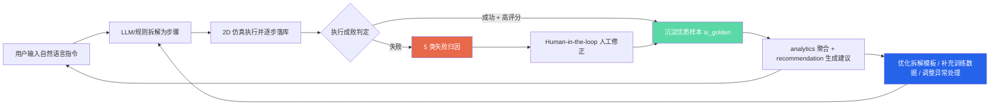

# 数据闭环设计文档

> 本文档依据技术契约 SPEC §5（失败原因 5 分类）与 §9（后端服务层职责）撰写，阐述「具身智能任务编排平台」如何把每一次任务执行沉淀为可复用的数据资产，构建"越用越好"的数据飞轮。这是产品的长期护城河：单次拆解的质量靠模型，**持续变好的能力靠数据闭环**。

## 一、为什么需要数据闭环

自然语言到机器人动作的拆解，本质上没有"一次写对"的银弹。指令千变万化、环境充满噪声、同一句话在不同场景下的最优拆解也不同。如果系统只是"输入指令 → 输出步骤 → 执行完抛弃"，那么它永远停留在第一天的水平。

数据闭环的核心主张是：**让系统的每一次运行都产生反馈信号，并把这些信号重新喂回拆解与执行环节**。用得越多，积累的真实场景样本越多，失败越能被归因，拆解模板越精准，最终形成正向循环。这正是 SPEC §9 中 `data_loop`、`analytics`、`recommendation` 三个服务协同要解决的问题。

## 二、自动采集哪些数据（采集层）

每次任务从"拆解"到"执行"再到"反馈"，系统在 `tasks` / `task_steps` / `feedback` 三张表（见 SPEC §2）中全链路落库。由 `services.data_loop.record_task(parsed, exec_result, strategy)` 统一写入，采集维度包括：

| 数据维度 | 落库字段 | 产品用途 |
|---|---|---|
| 原始指令 | `tasks.instruction` | 还原用户真实表达，挖掘高频任务 |
| 任务归类 | `tasks.task_type` | 分类型统计成功率，定位薄弱场景 |
| 拆解策略 | `tasks.strategy`（llm/rule） | 策略 A/B 对比，决定默认策略 |
| 拆解结果 | `tasks.goal` / `constraints` / `steps` / `exception_handling` | 评估拆解质量、沉淀模板 |
| 逐步执行日志 | `task_steps`（skill_code、params、status、duration_ms、error） | 步级回放，精确定位失败步 |
| 成败标记 | `tasks.success` / `status` | 北极星指标"任务成功率"的原子来源 |
| 失败分类与原因 | `tasks.failure_category` / `failure_reason` | 失败归因，驱动针对性优化 |
| 耗时 | `tasks.total_duration_ms` / `step_count` | 效率指标，发现冗余步骤 |
| 重试次数 | `tasks.retry_count` | 稳定性指标，识别脆弱技能 |
| 用户评分与反馈 | `tasks.rating` / `feedback_text` / `feedback` 表 | 满意度，主观质量信号 |
| 人工修正步骤 | `feedback.corrected_steps` | **最高价值监督信号**，详见第四节 |

采集遵循"零额外负担"原则：执行（`executor.simulate_execution`）一结束即自动落库，用户无感知。评分与修正则通过轻量交互（评分组件、修正弹窗）补充，不打断主流程。

## 三、失败原因 5 分类体系与判定逻辑

只统计"成功率"远远不够——知道"失败了"不能指导改进，知道"为什么失败"才能。SPEC §5 定义了统一的 5 类失败体系（前后端配色一致），覆盖具身智能从感知到执行的完整链路：

| key | 中文 | 含义 | 配色 |
|---|---|---|---|
| perception | 感知失败 | 识别错误、看不清、遮挡 | `#5B8FF9` |
| understanding | 理解失败 | 指令理解偏差、歧义 | `#5AD8A6` |
| planning | 规划失败 | 步骤不合理、顺序错误 | `#F6BD16` |
| execution | 执行失败 | 动作执行出错、抓取掉落 | `#E8684A` |
| environment | 环境异常 | 障碍物、物体移动、人员干扰 | `#9270CA` |

**判定逻辑**（`executor.simulate_execution` 产出 + `data_loop.classify_failure` 兜底）：当某一步执行失败时，依据失败发生的环节归类——感知类技能（`Recognize`/`Locate`/`Scan`/`CheckColor`）出错归为"感知失败"；指令本身有歧义、拆解目标偏离用户意图归为"理解失败"；步骤顺序错误、缺失必要前置步骤归为"规划失败"；操作类技能（`Grasp`/`Place`/`Pour` 等）动作出错归为"执行失败"；外部障碍、物体移位、人员干扰归为"环境异常"。`tasks.failure_category` 存中文，前端用上表映射配色，使每一类失败在看板上颜色一致、可追踪趋势。

这套体系的产品意义在于：它把模糊的"机器人不好用"转化为**可定位、可分配、可优化**的工程问题——感知失败找视觉团队、理解失败优化拆解提示词、规划失败迭代模板、执行失败调技能参数、环境异常补异常处理逻辑。

## 四、Human-in-the-loop 人工介入与修正流程

不是所有失败都能自动归因，也不是所有归因都准确。对于高价值或不确定的样本，引入"人在回路"（HITL）做兜底与监督。

**触发标记**：`data_loop.record_task` 在落库时按规则设置 `needs_review`——失败且缺少评分的任务，约 1/3 被标记为需人工介入（SPEC §9）。这保证了人工精力投向最可能产生增量价值的样本，而非全量复核。

**介入流程**：
1. 标记 `needs_review=1` 的任务进入待办队列（`GET /api/feedback/hitl`）。
2. 运营/PM 在「任务历史 → 需人工介入」标签页看到任务摘要（指令、类型、失败分类、步骤）。
3. 人工在修正弹窗里调整步骤、修正失败分类，提交 `POST /api/feedback/hitl/{id}/resolve`。
4. 系统更新 `steps`、写入 `feedback.corrected_steps`，并置 `is_golden=1`、`needs_review=0`——一次失败就此转化为一条带"标准答案"的监督样本。

人工修正后的步骤是整个系统中**信息密度最高的数据**：它直接告诉系统"这句指令的正确拆解长什么样"，是后续优化拆解模板和构造训练数据的黄金来源。

## 五、优质样本（is_golden）如何沉淀

`is_golden` 标记是数据资产的精华层，来源有二：

- **正反馈沉淀**：用户对一次执行给出高评分（`submitFeedback` 中携带 `corrected_steps` 或高 rating）→ 标记 `is_golden=1`、`needs_review=0`。代表"这个拆解被真人认可"。
- **人工修正沉淀**：HITL 流程修正后的样本必然 `is_golden=1`。代表"这个拆解被专家校准过"。

优质样本数（`is_golden` 计数）本身是 SPEC §7 的结果指标之一，反映系统知识库的厚度。它们构成一个不断增长的"指令 → 标准拆解"对照集，是飞轮的存储介质。

## 六、数据如何反哺——形成"越用越好"的飞轮

采集的数据经 `analytics`（聚合统计）→ `recommendation`（生成可执行建议）转化为三条反哺路径：

1. **优化拆解模板**：高频指令 + 其优质样本 → 提炼为定制化拆解模板（对应 `mock_llm.mock_parse` 中对 §6 十条示例的高质量定制拆解），让常见任务一次拆对。这些优质样本同时构成一套「指令 → 标准动作序列」的对照集，落到 25 个原子技能（**VLA 动作原语接口层**）上，即可作为未来微调真实 **VLA（视觉-语言-动作）模型**的监督数据。
2. **补充训练数据、定向补强泛化**：失败样本 + 人工修正样本 → 构造"指令-正确拆解"监督数据，未来接入真实大模型 / VLA 模型微调时直接复用，定向补强弱项（如"感知失败占比 35% → 补充遮挡场景数据"）。按任务类型 / 难度分桶统计的成功率，正是拆解**泛化能力（generalization）**的度量：哪些场景没见过就掉链子，数据会直接告诉你。
3. **调整异常处理**：高频失败原因 → 自动建议在 `exception_handling` 中加入对应防护（如抓取失败率高 → 默认加 `Retry` 重试 + `Confirm` 人工确认）。

`recommendation.generate_suggestions()` 把上述洞察落成 3-6 条带 `priority`/`evidence`/`metric` 的具体建议，呈现在数据看板，让 PM 一眼看到"下一步优化哪里、依据是什么"。

> **作为评测体系（benchmark）看待数据闭环**：把"成功率 + 失败 5 分类 + 优质样本数 + 分场景泛化度"当作一套持续运行的具身智能**评测口径**，闭环沉淀的每条样本既是训练素材、也是回归用例。这一评测口径与执行层解耦——当执行层从 2D 仿真升级到真机、或经 **Sim2Real（仿真到现实迁移）**把仿真优质样本迁移到真机、乃至前置引入**世界模型（World Model）**做任务可行性预判后，同一套指标仍能横向对齐"仿真 vs 真机"的能力差距，让飞轮在真实世界里继续转。

### 飞轮闭环图

闭环的关键在那条回到拆解环节（`I → B`）的箭头：每一轮使用都让拆解能力变强，新指令拆得更准、失败更少、优质样本积累更快——数据规模与产品质量互相强化，这就是"越用越好"的飞轮本质，也是平台相较于"纯调一次模型"方案的根本差异化价值。
